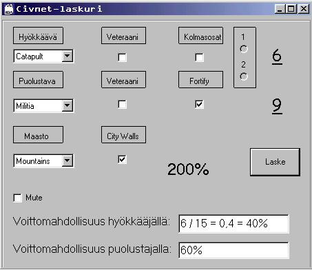
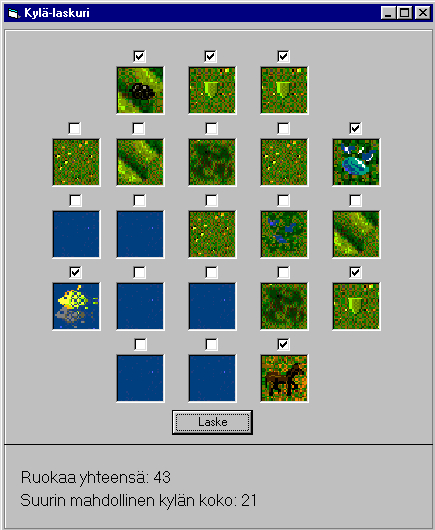
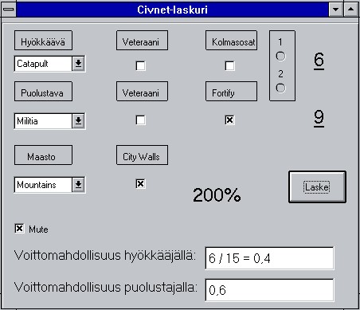

# Civnet-Laskuri ja Kylälaskuri

Sid Meier's CivNet -peliin kaksi ohjelmaa helpottamaan strategista suunnittelua.
Toimii kaikissa 32-bittisissä käyttöjärjestelmissä (Windows 95 -> Windows 11*).
Tehty käyttäen Visual Basic 6.0.

## Civnet-Laskuri

- Laskee hyökkäyksen onnistumisen todennäköisyyden
- *Windows 10 tai 11:a käyttäessä tulee ohjelmasta rastittaa Mute-laatikko, jotta ohjelma toimisi oikein

## Kylälaskuri

- Laskee suurimman mahdollisen kylän koon sille annetuista laatoista.
- Valintaruutu laatan yläpuolella vaihtaa "parempaan versioon" laatasta.

### CIVLAS16
Mukana myös Civnet-Laskurin 16-bittinen beta-versio, joka toimii Windows 3.1(1)-järjestelmissä.
Se on tehty käyttäen Visual Basic 4.0:a, joka on viimeinen 16-bittisyyttä tukeva Visual Basic -versio.

